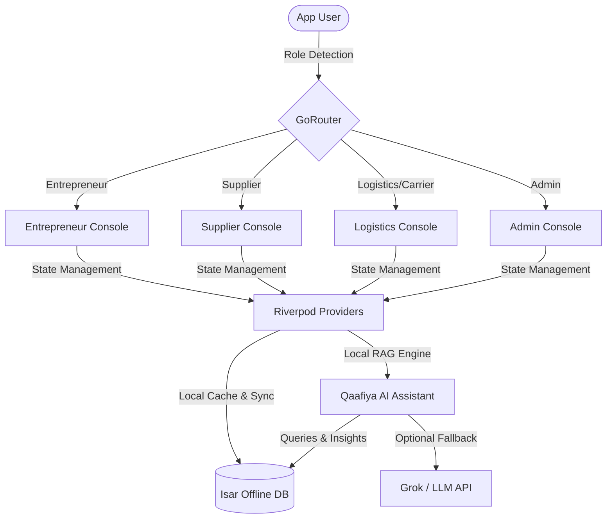

# 🚚📦 قافية • Qaafiya One OS

[](https://flutter.dev)
[](https://riverpod.dev)
[](https://isar.dev)
[-8E24AA?logo=google-gemini&style=for-the-badge)](https://x.ai)
[](https://flutter.dev)

**Qaafiya One OS** (derived from *Qaafiyah* meaning *caravan* or *rhythm*) is a premium, next-generation ERP, logistics, and supply chain management suite designed specifically for Indian small-to-medium enterprises (SMEs), suppliers, carriers, and administrators. 

It solves critical logistics hurdles (such as Return-to-Origin (RTO) tracking, inventory stock-outs, and margin leakage) through a local-first architecture, beautiful glassmorphism aesthetics, and a secure localized AI business advisor.

---

## 📸 Visual Overview & Architecture



---

## ✨ Core Features

### 👤 1. Multi-Role Console Systems
Different dashboards tailored for every actor in the caravan:
*   **Entrepreneur Console:** Track real-time sales metrics, revenue/profit curves, RTO trends, manage active orders, and monitor warehouse inventory status.
*   **Supplier Console:** Supervise raw material levels, process incoming merchant restocking demands, and track supply contracts.
*   **Logistics & Carrier Console:** Dispatch vehicles, update real-time transit points, monitor carrier capacity, and manage warehouse allocations.
*   **Admin Console:** Configure regional parameters, switch roles in real time, audit logs, and oversee the entire mesh network.

### 🧠 2. Qaafiya AI Assistant (Local RAG)
An intelligent assistant equipped with a Local Retrieval-Augmented Generation (RAG) engine that operates directly on your local database:
*   **Zero-latency RAG:** Answers questions regarding sales volumes, inventory margins, and low-stock products entirely offline.
*   **Smart Risk Diagnostics:** Automatically calculates **Return to Origin (RTO) rates** and flags high-risk orders.
*   **Actionable Advice:** Recommends delivery safeguards (e.g., routing Tier-2 shipments via premium carriers like BlueDart, or triggering automatic WhatsApp dispatch confirmations).
*   **Multi-LLM Connectors:** Native setup for offline fallback plus Grok API connectivity.

### 📊 3. Premium Interactive Analytics
*   Stunning, responsive line and bar charts using `fl_chart`.
*   Indian Rupee (INR - ₹) localization for native accounting representation.
*   Toggleable views for daily, weekly, and monthly performance indicators.

### 💎 4. Immersive Glassmorphism UI
*   A premium, state-of-the-art dark & light gold/charcoal theme (`AppTheme`).
*   Interactive frosted-glass panels (`GlassCard`) with custom glow shaders, hover states, and spring-based micro-animations.

### 🛡 5. June 2026 Redesign & Data Safety Enhancements
*   **Premium Blending Bottom Nav**: A full-width gradient transparent-blended navigation bar allowing screen contents to scroll dynamically behind it.
*   **Data Action Confirmation System**: Added modal confirmation dialogs for key state changes (language switch, theme toggle, session logout) and all database record deletions (orders, products, warehouses, suppliers, feed updates, support tickets) to prevent accidental data loss.

---

## 🛠 Tech Stack

| Technology / Package | Purpose |
| :--- | :--- |
| **Flutter SDK** | Multiplatform framework (iOS, Android, macOS, Web) |
| **Flutter Riverpod** | High-performance reactive state management |
| **GoRouter** | Declarative routing system with support for path-based deep linking |
| **Isar DB** | Super-fast, compile-time type-safe, offline-first NoSQL database |
| **FL Chart** | Interactive data visualization and dynamic financial reports |
| **Google Fonts** | Elegant custom typography (Inter, Outfit, etc.) |
| **Freezed & Build Runner** | Type-safe code generation for data models |

---

## 🚀 Getting Started

### Prerequisites
Ensure you have the following installed on your machine:
*   [Flutter SDK (3.6.1 or later)](https://docs.flutter.dev/get-started/install)
*   Dart SDK
*   CocoaPods (if running on iOS or macOS)

### Installation & Run

1.  **Clone the Repository:**
    ```bash
    git clone https://github.com/faizanansari72/qaafiyah.git
    cd qaafiyah
    ```

2.  **Install Dependencies:**
    ```bash
    flutter pub get
    ```

3.  **Run Code Generation:**
    Generate data models, Isar collections, and JSON serializers:
    ```bash
    dart run build_runner build --delete-conflicting-outputs
    ```

4.  **Run the Application:**
    *   **For Mobile / Emulators:**
        ```bash
        flutter run
        ```
    *   **For Desktop (macOS):**
        ```bash
        flutter run -d macos
        ```

---

## 📁 Project Structure

```text
lib/
├── core/                  # Design system tokens, global widgets, and localization
│   ├── constants/         # App constants and configuration
│   ├── localization/      # Translation tables and multi-lingual helpers
│   ├── theme/             # Premium Light & Dark Gold themes
│   └── widgets/           # Global reusable UI (GlassCard, Custom dialogs)
├── data/                  # Data models, Isar schemas, and repository implementations
├── domain/                # Business logic contracts and interfaces
├── presentation/          # Riverpod providers, controllers, and screens
│   ├── providers/         # Global state providers (Order lists, active profiles)
│   └── screens/           # Modules (AI Assistant, Analytics, COD, Warehouses, etc.)
└── routes/                # GoRouter routing declarations
```

---

## 🛡 License & Contributions
Distributed under the MIT License. See `LICENSE` for more information.

Developed with ❤️ by **Mohd Faizan Ansari** ([@faizanansari72](https://github.com/faizanansari72))
